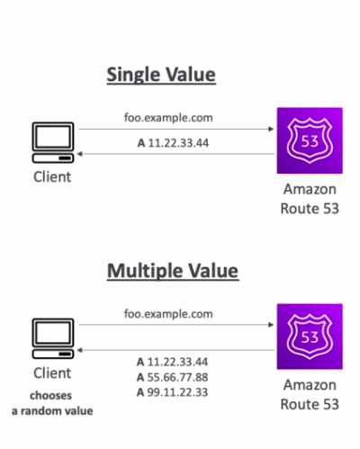

# DNS

- Domain Name System. 

- Used to translate hostnames to machine's IP addresses (server IP Addresses)

- Backbone of the internet 
  


## Hierarchical Naming structure

```
        .com                            # TLD - Top Level Domain
          |
          |
          v
      example.com                       # SLD - Second level Domain
          |
          |
          v
    www.example.com                     # Sub Domain
          |
          |
          v
   api.www.example.com                  # Domain Name
          |
          |
          v
  http://api.www.example.com.           # FQDN - Fully Qualified Domain Name
                                                (Protocol + Domain Name)

```

## DNS Terminologies

- **Domain Registrar**: Where you register your domain. Amazon Route 53, GoDaddy

- **Types of DNS Records**: A, AAAA, CNAME, NS

- **Zone File**: Contains all DNS Records (this is how to match these host names to IPs or addresses.)

- **Name Servers**: Used to resolve DNS queries

- **Top Level Domain** (TLD): .com, .net, .org

- **Second Level Domain** (SLD): amazon.com, google.com  

   

## How DNS Works

(i) **LOCAL DNS SERVER** : On searching for a website, your web browser talks to the **local DNS server** (managed by ISP) to get the address for the hostname

(ii) **ROOT DNS SERVER** : If the local DNS server does not have it, it talks to the **Root DNS server** which provides the TLD server's address

(iii) **TLD DNS SERVER** : Then, your computer talks to the **TLD DNS Server** which provides the address of SLD DNS Server

(iv) **SLD DNS SERVER** :  So, you connect to the **SLD DNS Server** which is managed by the Domain Registrar of the website. 

(v) finally, address for the actual website that was searched is obtained and connection is made. 

(vi) The IP address for the hostname is then cached in local DNS server as well as in your computer


# Route 53

- It is a highly available, scalable, fully managed and authoritative DNS Service
    
    - **Authoritative** : The customer can update the DNS Records

    - For instance, when clients want to access your EC2 Instance @example.com but right now your EC2 Instance only has a public IP, 
    
        - some DNS records are written into Amazon Route 53 (into a hosted zone) 
        
        - when the client is asking for example.com, then the Route 53 service will be able to tell the IP address
        
        - then the clients will be able to connect directly into your EC2 Instance.

- a Domain Registrar (able to register our own domain names)

- has the ability to check the health of the resources

- Only service that provides 100% availability SLA (Service Level Agreement)
    
    - **100% availability SLA** : Route 53 is 100% available service. If it is not available anytime, you get some credits based on the agreement

- Why Route '53'? - 53 is a reference to a traditional DNS port. So hence the name Route 53

- Not free to use service ($0.50 per month per hosted zone)

# Route 53 - Records

- In Route 53, you're going to define a bunch of DNS records and the records define how you want to route traffic to a specific domain.

- Each DNS Record contains the following info :
    
    - **Domain Name / Subdomain Name**
    
    - **Record Type**: A, AAAA, CNAME, NS
    
    - **IP address**: Actual address to which the traffic needs to be routed to 
    
    - **Routing Policy** : how Route 53 responds to queries
    
    - **TTL**: (Time To Live) Amnt of time the DNS record should be cached in the DNS Resolver

## Route 53 - Record Types

- **A**: maps a hostname to an IPv4 address

- **AAAA**: maps a hostname to an IPv6 address

- **CNAME**: maps one hostname to another hostname
    
    - The hostname must be an A/AAAA record
    
    - CNAME record can't be created for top node of a DNS Namespace (zone apex)
        
    - Eg: CNAME cannot be used to map example.com but can be used for www.example.com

- **NS**: NameServers for the hosted zone
    
    - These are the DNS servers/ IP Addresses that responds to your DNS queries for your hosted zone

    - Control how traffic routed for a domain

# Route 53 - Hosted Zones :

- A container for Records that defines how the traffic is routed to your domains/subdomains

- 2 types :

    - **Public hosted Zone** : contains records that specifies how the Internet traffic is routed (public domain names)

    - **Private hosted zone** : contains records that specifies how the traffic within your VPC is routed (private domain names)

 


# TTL (Time To Live)

- defines the duration until which the record will be cached in the client's computer

- So within this duration, if the web browser requests an IP for the same hostname, it is fetched from the cache, not from Route 53

- **High TTL** 
    
    - Records will be outdated for that time period in case if you modify your record
    
    - Less costs incurred on Route 53 because less requests received

- **Low TTL**
    
    - Records are updated quick in case of any change in the record
    
    - Can cost more if, more request for DNS queries is sent to Route 53

    - Easy to change records

- Except for Alias records, TTL is mandatory for every DNS record    

 

# CNAME vs Alias record

## CNAME
    
- Used to map a hostname to another hostname

- The hostname must be an A/AAAA record

- Only works for a non-root domain ( like api.example.com)

## Alias
    
- Used to map a hostname to an AWS resource

- Can be used for both root domain (like example.com) and non-root domain (like api.example.com)

- as native health checks

- are free of charge

# Alias Records

- Maps a hostname to an AWS Resource

- Many AWS resources provide a DNS endpoint. With Alias record, you can map a hostname to these DNS endpoints

- Automatically recognizes changes in the resource's IP Addresses

- Can be used for the top node of a DNS namespace (zone apex)
    
- Alias Record is always of type A/AAAA record for AWS resources (IPv4/IPv6)

- You can't set TTL for Alias records

- _**Alias Record targets**_ 

    - ELB
    
    - CloudFront Distribution
    
    - API Gateway
    
    - Elastic Beanstalk Environments
    
    - S3 Websites
    
    - Global Accelerator
    
    - VPC Interface Endpoints
    
    - Route 53 Records in the same hosted Zone

- An EC2 instance DNS endpoint cannot be mapped in an ALIAS record type 

# Route53 Routing Policies

- defines how Route53 responds to a DNS query

- 7 types :

    - Simple

    - Weighted

    - Failover

    - Latency Based

    - Geolocation

    - Multi-Value Answer

    - GeoProximity

# Simple Routing Policy

- Returns a DNS record for the given hostname

- Routes traffic to a single resource

- Can also specify multiple values(IP) in the same record. If multiple values are specified, one is chosen randomly by the client

- With Aliases enabled, can only specify one AWS resource

- Can't be associated with health checks 



# Weighted Routing Policy

- Can control the % of requests that go to each resource

- Can assign weight to multiple records and according to the weight assigned, the traffic will be sent to the resource on that record

      traffic % =       weight for a specific record
                  --------------------------------------
                  Sum of all the weights for all records 
- The records must have the **same hostname** and **same record type**

- Can be associated with health checks

- _**Use cases**_: 

    - load balancing between regions
    
    - testing new application versions

- The weights don't have to sum up to 100

- Assign a weight of 0 to a record to stop sending traffic to a resource
 
- If all records have weight of 0, then all records will be returned equally


# Latency Based Routing Policy

- Used to redirect users based on the least latency close to you

- Latency is based on traffic between users and AWS regions

- Can be associated with health checks (has failover capability)
 
- NOTE : Latency is based on the AWS Region. The closer the region, lower the latency 

## Route 53 Health Checks

- HTTP based health checks for public resources

- They allow you to perform automatic DNS failover

- 3 types of healthchecks:
    
    - Healthchecks on a particular endpoint
    
    - Healthchecks that monitor other healthchecks (Calculated Healthchecks)
    
    - Healthchecks on CloudWatch alarms 

- These healthchecks are integrated with CloudWatch(CW) Metrics

## Health checks - Monitor an Endpoint

- About 15 healthcheckers from various region perform these healthchecks to check the endpoint health

- In these healthchecks you can specify:
    
    - Healthy/unhealthy threshold - 3 (default)
    
    - Healthchecks Interval (defaults to 30 sec) | if set to 10 sec interval - higher cost
    
    - Supported Protocols: HTTP, HTTPS, TCP
    
    - choice of Regions/locations for Route53 to use

- If > 18% of healthchecks pass, it is considered healthy, else unhealthy

- Healthchecks pass only when endpoints responds with 2xx/3xx status codes

- Healthchecks can also be setup to pass/fail based on checking the first 5120 bytes of a text-based response

- The resources must have configured firewall (SGs) to allow incoming requests from  Route53 healthcheckers

## Health Checks - Calculated Health Checks

- A master healthchecker monitors the child healthchecks

- Can monitor up to 256 child healthchecks

- Can specify amount of healthchecks that need to pass, to make the master healthcheck healthy

## Health Checks - Private Hosted Zones

- Route53 health checks cannot access private endpoints (on-premises/private VPC) as Route53 health checkers are outside the VPC

- You need to create a cloudWatch metric and associate a CloudWatch Alarm to it
(monitoring the health of the EC2 instance in a private subnet using CloudWatch metric)

- The cloudWatch Alarm can be monitored using Route53 healthchecks and is considered unhealthy if the CloudWatch Alarm is in the alarm state

# Failover Routing Policy

- Here, the healthcheck is performed, and only the the record of the healthy instance is returned to the user

- there can be only one primary and one secondary record

- So here, we create two records with the same hostname just like previous routing policies

- In, one of the records we connect to a primary resource and a secondary resource in other one

- The primary record must be associated with a healthcheck, so that when the instance/resource in the primary record is unhealthy, it failovers to the instanc in the secondary record


# Geolocation Routing Policy

- Route users based on their location

- You can specify a continent, a country or a US state 

- Must create a "default" record, if the location does not match

- Can be associated with health checks

# GeoProximity Routing Policy

- In this type of routing policy, you can shift more traffic to specific resource(s)

- Here, you need to specify a bias value

- According to the bias value the traffic is redirected to the resource
    
    - A resource in a region with a higher bias will attract more traffic

- A resource can be:
 
    - An AWS Resource (need to specify AWS Region)
    
    - Non-AWS Resource (need to specify Latitude and Longitude) | (On-premises erver -> Non-AWS Resource)

- You must use Route53 Traffic Flow to use this feature

## Route53 Traffic Flow

- A Visual Editor for creating and managing more complex routing decision trees 

- Simplified process of creating and managing records in large and complex configurations 

- Configurations can be saved as Traffic Flow Policy
    
    - Can be applied to different Route53 hosted zones (ie- different domain names)
    
    - Supports versioning

- Multiple Policies can be probably chained in a traffic flow policy

# Multi-Value Routing Policy

- Used when routing traffic to multiple resources

- Returns multiple records for the clients to choose from 

- Has healthchecks associated with it. So, only healthy records are returned

- Up to 8 records can be returned for each Multi-Value query

- It is different from specifying multiple records in Simple Routing Policy 

    - Simple Routing Policy does not have health checks associated with it, so it might return an unhealthy record.
    
- While creating records for multiple resources using this policy, you don't specify multiple values in one record rather you need to create multiple records each referring to one resource

# Domain Registrar vs DNS Service

- Domain Registrars like GoDaddy also come with DNS Service. But you can choose to use a DNS Service of your choice. (Amazon Route53)

- To use a 3rd party domain name:
    
    - You create a Hosted Zone in Route53 first
    
    - Then, you go to the domain registrar's website and set the nameservers of your domain = nameservers in your hostedZone
        
        