# VPC

- VPC - Virtual Private Cloud

- Can have multiple VPC in an AWS region (SOFT LIMIT : max 5 per region -> you can increase it)

- Max CIDR per VPC : 5

- For each CIDR :

    - Min size : /28 (16 IPs)

    - Max size : /16 (65536 IPs)

- VPC is private and hence the following ranges are only permitted :

    - 10.0.0.0 - 10.255.255.255 (10.0.0.0/8)

    - 172.16.0.0 - 172.31.255.255 (172.16.0.0/12)

    - 192.168.0.0 - 192.168.255.255 (192.168.0.0/16)

- VPC CIDR should not overlap with other networks

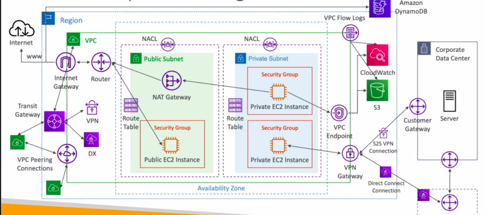

# CIDR - IPv4

- Classless Inter-Domain Routing 

- A method for allocating IP Addresses (defines the IP address range)

- Used in Security Groups rules and AWS networking 

- Eg : 0.0.0.0/0 (allows all IPS from 0.0.0.0 to 255.255.255.255)

- CIDR has 2 parts

    - _**BASE IP**_ :

        - The IP address contained within the range 

        - Eg : 192.168.0.0

    - _**SUBNET MASK**_ :

        - Defines how many bits can change in the IP

        - Eg : /0, /24, /32

        - Can be of 2 forms :

            - /0, /8, /16, /32 (most commonly used)

            - 0.0.0.0, 255.0.0.0, 255.255.0.0, 255.255.255.255

        - Basically allows part of the underlying IP to get additional next values from the base IP

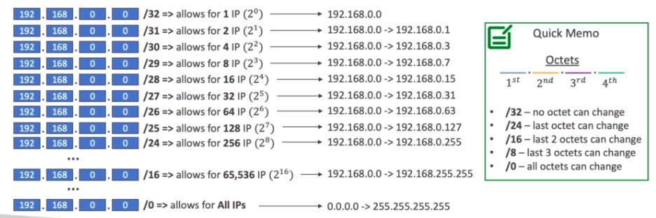

# Public vs Private IP (IPv4)

- The Internet Assigned Numbers Authority (IANA) established certain blocks of IPv4 addresses for the use of private (LAN) and public (Internet) addresses.

- _**Private IP**_ :

    - _**BIG NETWORKS**_ : 10.0.0.0 - 10.255.255.255 (10.0.0.0/8) 

    - _**AWS DEFAULT VPC RANGE**_ : 172.16.0.0 - 172.31.255.255 (172.16.0.0/12)

    - _**HOME NETWORKS**_ : 192.168.0.0 - 192.168.255.255 (192.168.0.0/16)

- _**Public IP**_ :

    - All the rest of the IP Addresses on the internet are Public IP

# Default VPC 

- When you create an account a default VPC is created for you to immediately deploy instances. (new EC2 instances are launched into the default VPC if no subnet specified)

- Has 3 subnet in 3 different availabilty zone to have a highly available architecture

- All subnets in default VPC have a route out to the internet

- Each EC2 instance in default VPC will have a public and private IPv4 DNS names

- If you delete default VPC, only way to restore it is by contacting Amazon.

# VPC - Subnet (IPv4)

- 5 IP addresses in each subnet

- These 5 IP addresses are reserved and not available for use (can't be assigned to an EC2 instance)

- Eg : CIDR block - 10.0.0.0/24 Reserved IP addresses :

    - 10.0.0.0 - Network address

    - 10.0.0.1 - for VPC router

    - 10.0.0.2 - for mapping to Amazon-provided DNS

    - 10.0.0.3 - for future use

    - 10.0.0.255 - Nework broadcast address (AWS doesn't support broadcast in a VPC thus, the address is reserved)

- (IMP) If you need 29 IP addresses for EC2 instances

    - You can't choose a subnet of size /27 => 32 IP addresses - 5 reserved IPs = 27 < 29
    - You've to choose a subnet of size /26 => 64 IP addresses - 5 reserved IPs = 59 > 29

# Internet Gateway (IGW)

- Allows resources in a VPC connect to the internet (Eg : EC2 instance)

- scales automatically and is highly available and redundant

- Must be created seperately from a VPC

- One VPC can only be attached to one IGW and vice versa

- IGW on their own don't allow internet access, route tables has to be edited 

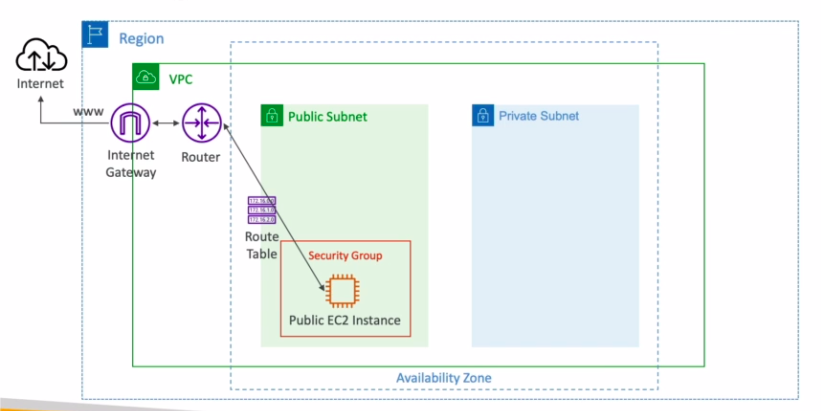

# Bastion Hosts

- Used to SSH into private EC2 instances

- Bastion -> public subnet which is connected to all other private subnets

- Bastion Host SG must be tightened

- Make sure the bastion host only has port 22 traffic from the IP address you need, not from the SG of other EC2 instances

    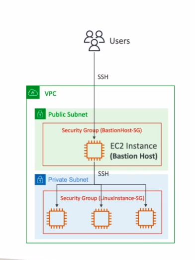

# NAT instances

- Network Address Translation

- Allows EC2 instances in private subnets to connect to the internet

- Must be launched in a public subnet

- Must disable EC2 setting : Source/destination check

- Must have Elastic IP attached to it

- Route Tables must be configured to route traffic from private subnets to the NAT instance

    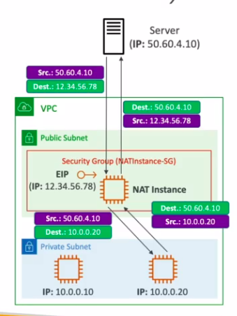

- Pre-configure Amazon Linux AMI is available

- Not highly available/resilient setup out of the box

- Internet traffic bandwidth depends on EC2 instance type

- You must manage SG rules :

    - _**Inbound**_ : 

        - Allow HTTP/HTTPS traffic coming from private Subnets

        - Allow SSH from your home network

    - _**Outbound**_ :

        - Allow HTTP/HTTPS traffic to the internet

# NAT gateway 

- AWS-managed NAT, higher bandwidth, high availability, no administration

- pay per hour usage and bandwidth

- NATGW is created in specific AZ ; uses Elastic IP

- Can't be used by EC2 instance in the same subnet (only from the other subnets)

- Requires an IGW (private subnet => NATGW => IGW)

- 5 GBps of bandwidth with automatic scaling up to 45 GBps

- No SG to manage / required

    - no need to think about which ports you enable to make the connectivity work

## NAT gateway with High availability

- NAT gateway is resilient within a single AZ

- Must create multiple NAT gateways in multiple AZs for fault tolerance

- No cross-AZ failover needed (if an AZ goes down it doesn't need NAT)

## NAT Gateway vs NAT Instance

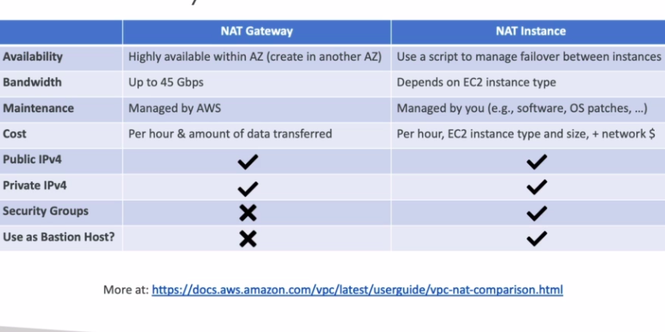

# DNS Resolution in VPC

## DNS Resolution (enableDnsSupport)

- Decides if DNS resolution from Route53 Resolver Server is supported for the VPC

- True (default) : it queries the Amazon Provider DNS server at 169.254.169.253 or the reserved IP address at the base of the VPC IPv4 network range plus two

## DNS HostNames (enableDnsHostnames)

- By default,

    True => default VPC

    False => newly create VPCs

- Won't do anything unless enableDnsSupport = true

- If True, assigns public hostname to EC2 instance if it has a public IPv4

### NOTE : If you use custom DNS domain names in a Private Hosted Zone in Route 53, you must set both the attributes :

- enableDnsSupport = True

- enableDnsHostname = True

# Security Groups and NACLs

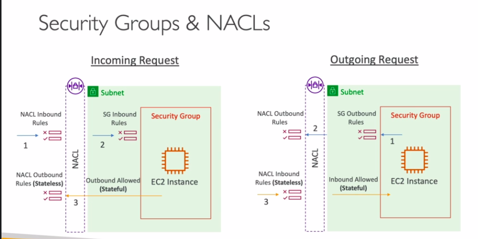

## NACL

- Network Access Control List

- Are like firewall which control traffic from and to subnets

- One NACL per subnet, new subnet are assigned the default NACL

- You define NACL Rules :

    - Rules have a number (1-32766) 
    
    - higher precedence with a lower number (1 has max precedence)

    - First Rule match will drive the decision

        - Eg : If you define #100 ALLOW 10.0.0.10/32 and #200 DENY 10.0.0.10/32, IP address will be allowed as 100 takes higher precedence over 200

    - Last rule is an * and denies a request in case of no rule match

    - AWS recommends adding rules by increment of 100

        - the reason is that if you want to add rules in between then, you are fine.

- Newly create NACLs will deny everything by default

- _**USE CASE**_:

    - NACL are a great way of blocking a specific IP address at the subnet level

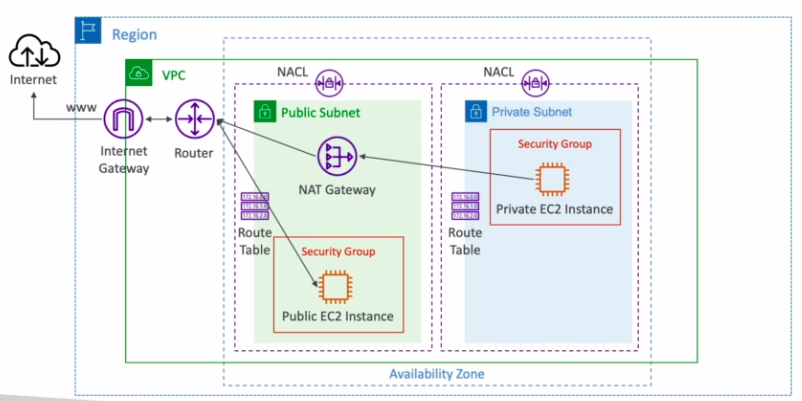

## Default NACL (important)

- Accepts everything inbound/outbound with the subnets it's associated with

- Do not modify the default NACL instead create custom NACLs

## Ephemeral Ports

- Ports are used to establish a connection between 2 endpoints

- Clients connect to a defined port and expect a response on a ephemeral port

- This port lives as long as the connection is enabled

- Based on the OS, different port ranges for ephemeral port :

    - IANA and MS windows 10 => 49152 - 65535

    - Linux kernels => 32768 - 60999

## Security Group vs NACLs

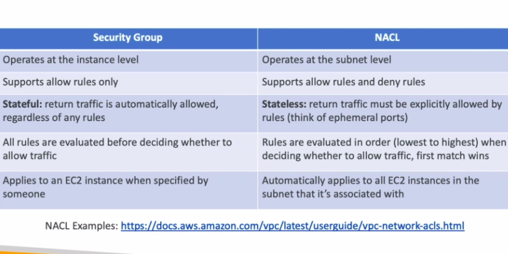

# VPC - Reachability Analyzer

- A network diagnostics tool that troubleshoots network connectivity between two end points in your VPCs.

- Instead of having to dig through the network configuration and understand where the error is happening, this builds a model of network configuration between these two end points, and then it will check the reachability based on the configuration within your AWS accounts.

- It doesn't not actually send back packets from source to destination. It just analyzes your configuration and tell you what's happening, which is very powerful.

- When the destination is 

    - _**Reachable**_ - it produces hop-by-hop details of the virtual network path

    - _**Not reachable**_ - it identifies the blocking component(s) (Eg : config issues in SGs, NACLs, Route Tables)

- _**Use cases**_ :

    - Troubleshoot connectivity issues

    - Ensure network config is as intended

# VPC Peering

- You can create VPCs in different regions, in different accounts. VPC peering privately connects the VPCs together using the AWS network.

- _**Why do you need to establish this connection ?**_

    - make the VPCs behave as if they were in the same network

- VPC network CIDRs must be distinct from each other because when you connect them together if they have overlapping centers, they will not be able to communicate.

- VPC Peering connection is not transitive.

    - This means each VPC that wants to communicate with one another must have VPC Peering enabled.

    - For an instance,

        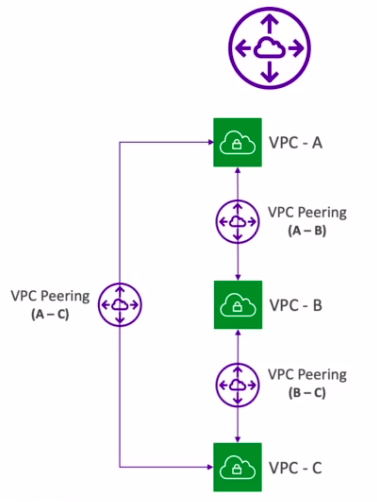

        - You can create a peering connection between A and B and this is allowing you to connect them together.

        - And you can create another peering connection between B and C so that they can communicate together

        - Even though A and B and B and C are connected, you still need to enable a VPC Peering connection between A and C to have them communicate. (since the connections are not transitive) 

- You must update route tables in each VPC's subnets to ensure EC2 instances can communicate with each other

- VPC Peering connection can be established 

    - within the same account

    - across different accounts

    - across different regions

- VPC peering is very powerful

- You can reference a SG in a peered VPC (works across accounts - same region)

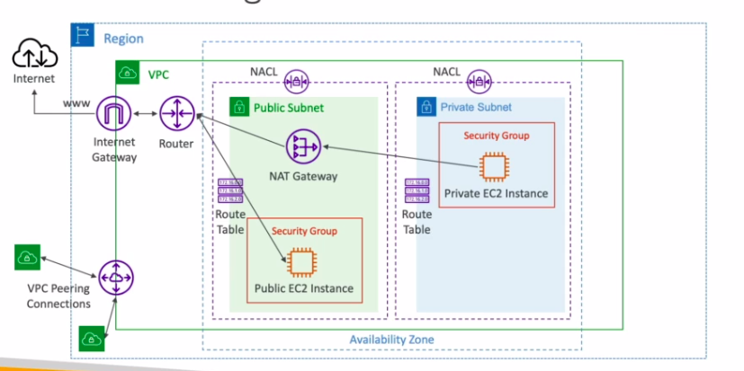

# VPC Endpoints (powered by AWS PrivateLink)

- All services in AWS have a public URL (publicly exposed)

- The VPC endpoints will allow you to connect to these services using a private network instead of using the public internet.

- They're redundant and the scale horizontally (no scaling concerns)

- They remove the need to have an internet gateway or NAT gateway to access AWS services which can be some good cost savings.

- In case of issues with VPC endpoints,

    - make sure that DNS setting resolution in your VPC is activated

    - check the route tables in your VPC (because you must modify them)

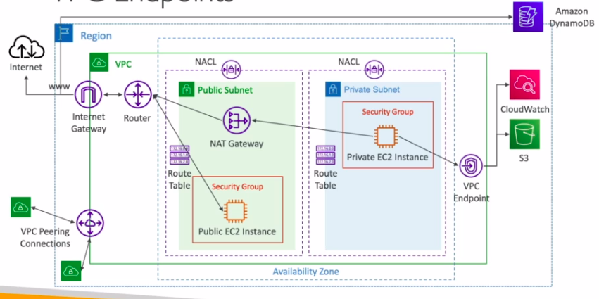

## Types of Endpoints

### **_Interface Endpoints_**

   - Provisions an ENI (Private IP address) as an entry point (must attach a SG)

   - Supports most AWS services

### **_Gateway Endpoints_** 

   - Provisions a gateway and must be used as a target in a route table

   - Supports S3 and DynamoDB

# VPC Flow Logs 

- Allows you to capture information from IP traffic going into your interfaces.

    - VPC level - VPC FLow Logs
    
    - Subnet level - Subnet Flow Logs

    - Elastic Network Interface(ENI) level - ENI FlowLogs

- Helpful to monitor and troubleshoot connectivity issues happening within your VPC.

- Flow logs data can be sent to two destinations.

    - Amazon S3
    
    - CloudWatch logs

- They will capture information from AWS managed interfaces,

    - ELB
    
    - RDS
    
    - ElastiCache

    - Redshift
    
    - WorkSpaces
    
    - NATGateway

    - Transit gateway, and so on.

## Information you can get from these logs 

- srcaddr and dstaddr - help identify problematic IP

- srcport and dstport - help identify problematic ports

- Action - success or failure of the request due to SG / NACL

- Can be used for analytics on usage patterns or malicious behavior

- Query VPC flow logs using Athena on S3 or CloudWatch Logs Insights

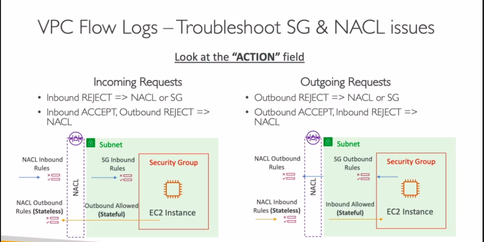

# AWS Site-to-Site VPN

- You have a VPC, but you may have also a structure within the corporate data center and connect AWS to the corporate data center using a private connection.

- For this, you'll have a _**customer gateway**_ on the corporation side and a _**VPN gateway**_ on the VPC side.

- A private site-to-site VPN connection is established through the public internet.

- It's a VPN connection - encrypted and goes over the public internet.

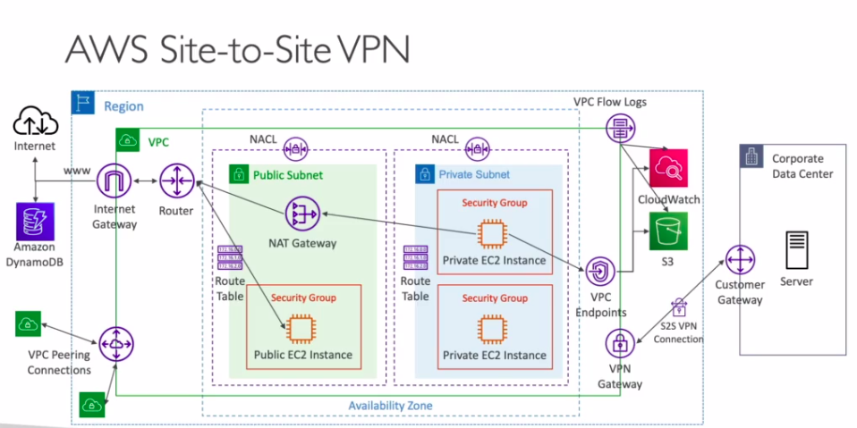

- The VPNs need two things

    - _**Virtual private gateway (VGW)**_ :

        - A VPN concentrator on the AWS side of the VPN connection

        - VGW is created and attached to the VPC from which you want to create the site-to-site VPN connection.

        - Possible for you to customize the ASN number (Autonomous System Number)

    - _**The customer gateway (CGW)**_ :

        - An actual software or a physical device on customer side (data center side of the VPN connection)

## Site-to-site VPN Connections 

- _**how to set up the customer gateway device that is on premises?**_

    - Which IP address should we use?

        - If your customer gateway is public - use the public internet-routable IP address that is present for your customer gateway device to establish the connectivity between VGW and CGW

        - If your customer gateway is private and have a private IP - it is behind a NAT device that has NAT-T enabled (NAT device has a public IP). Use the public IP of the NAT device for CGW to establish site-to-site VPN connection

- The site-to-site VPN connection will not work until you enable _**route propagation**_ for your VPC in the route table associated with your subnets.

- If you need to ping your EC2 instances from on-premises to AWS, then make sure that the ICMP protocol on the inbound of the security group is enabled. Otherwise, the connection will not work. (a security group question) 

## AWS VPN CloudHub.

- CloudHub is to provide secure communication in between multiple sites, using multiple VPN connections.

- It's a low-cost hub-and-spoke model for primary or secondary network connectivity between different locations (only using the VPN)

- You would establish a site-to-site VPN between the CGW and the one single VGW within your VPC. Then your customer networks can now communicate with one another through that VPN connection.

- Because it's a VPN connection, all the traffic goes over the public internet. So they're not connected through a private network but encrypted

- To set it up, 
    
    - you set up multiple site-to-site VPN connection on the same virtual private gateway
    
    - you enable dynamic routing 
    
    - then you configure your route tables.

    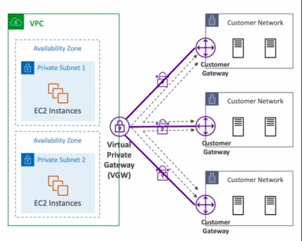

# Direct Connect (DX)

- provides a dedicated private connection from the remote network into your VPC.

- uses an AWS Direct Connect location.

- You also need to set up a virtual private gateway on your VPC side to make the connectivity between your on-premise data center and AWS.

- On the same connection you can access both public resources such as Amazon S3 and private resources such as EC2 Instances using the the public VIF and the private VIF.

- _**Use cases**_:

    - you get increased bandwidth throughputs, that means that if you're working with large data sets is going to be faster because it doesn't go over the public internet 

    - lower cost because you're using a private connection

    - if you have connectivity issues using the public internet, you'll use Direct Connect to  get a more consistent network experience because it is private.

    - this is especially helpful if you have applications using real time data feeds.

- it supports hybrid environments because you have connectivity between your own premises data center and the cloud.

- It supports both IPv4 four and IPv6.

# AWS PrivateLink (VPC Endpoints Services)

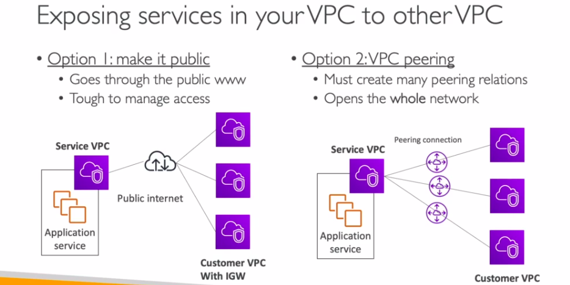

OPTION 3 : AWS PrivateLink

- it's a more secure and scalable way to expose the service (to thousands of VPC) either in your own or other accounts. (IMPORTANT)

- it does not require a VPC peering or internet gateway or knots or route tables. 
So the way it works is that you have a service VPC.

- For instance,

    - To expose the application service to consumer application, the network load balancer is placed in application.

    - The NLB is going to expose the application service. 

    - On the customer VPC side, create an ENI.

    - This ENI through PrivateLink is going to be connected to your network load balancer.

    - So to establish a connection between the NLB and the ENI there was no need to establish VPC peering.

    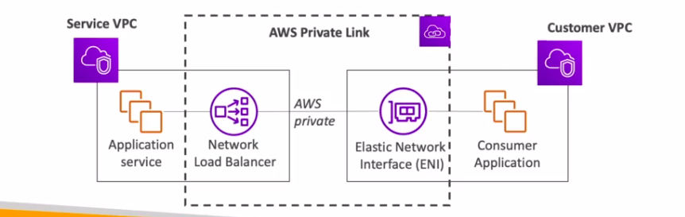

- If the NLB is in multiple availability zones, then you need ENIs in multiple availability zones and you have a fault tolerance solution

## VPC Private Link and ECS

- You have an ECS service with multiple tasks. They're exposed to an application.

- You need a network load balancer to expose this. How is it done?

    - You connect a network load balancer to the application load balancer (because the ALB can now be a targets of the NLB)

    - The PrivateLink can be established directly into your NLB.

- For other VPCs, it could be an ENI directly into PrivateLink.

- For your corporate data center, it could be a private connection, 

    - going over direct connect

    - or a VPN connection. 

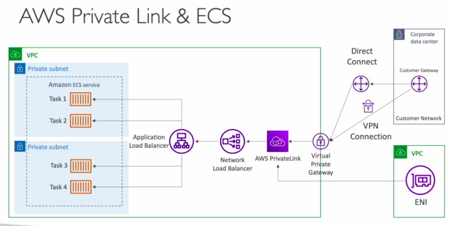

# EC2-Classic and ClassicLink.

- Both these things are deprecated by AWS (it's most likely going to be a distractor in exam)

- _**EC2-Classic**_: instances run in a single network shared with other customers, this is how AWS started.

- _**Amazon VPC**_ : And then AWS came up with Amazon VPC, where your instances now run logically isolated in your AWS account.

- _**ClassicLink**_ : 

    - when you wanted to have a link between your VPC and your EC2-Classic instances, you would need to create a Classic link.

    - For this you must associate a security group
    
    - Enables your instances to communicate privately from EC2-Classic to your VPC instances using IPv4 private addresses.

    - Removes the need to make use of public IPv4/ Elastic IP Addresses

# Transit Gateway

## USE CASE 1 : Reduce complexity of the network topologies

- Network topologies can become more complicated with VPC peering, VPN connection, direct connect and so on.

- Transit gateway is a solution for this. 

- It is for having a transitive peering connection between thousands of VPC on-premises data center, site-to-site VPN, direct connects in a hub-and-spoke (star) connection.

- It's a regional resource and it can work cross-region

- Can share transit gateway across accounts by using the resource access manager (RAM)

- You can peer transit gateways across region.

- How to define who can talk to what?

    - you need to create route tables

    - Route Tables : to limit which VPC can talk to another, which connection have access to each other and so on.

    - you get full control over the routing of all the traffic within the transit gateway to give you network security.

- Works with direct connect gateway and VPN connections

- It is the only service in AWS that supports IP multicast (Important)

## USE CASE 2 : Site to Site VPN ECMP

- ECMP = Equal-cost multi path routing

- Routing strategy to allow to forward a packet over multiple best path

- Helps creating Site to Site VPN connections to increase the bandwidth of your connections in AWS
   
- ### VPN to VPGW

    - 1 tunnel = 1 connection into 1 VPC 
    
    - 1.25 GBps Max Throughput(limited)

    - VPN connection is made of 2 tunnels

- ### VPN to transit gateway

    - 1 site to site VPN into many VPCs

    - 2.5 GBps Max throughput

    - 2 tunnels are used

    - Can add more site to site VPN connections to increase throughput

        - 2 Site to site VPN conn - 5 GBps

        - 3 Site to site VPN conn - 7 GBps

    - Pay for each GB of data through Transit Gateway

## USE CASE 3 : Share Direct Connect Connection b/w multiple accounts

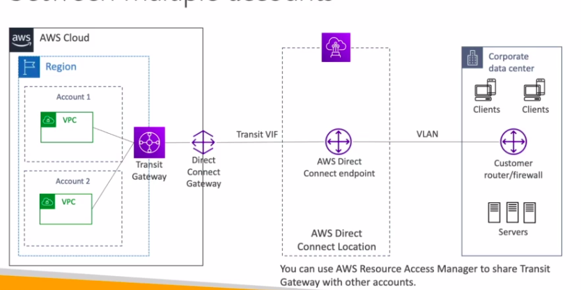

# VPC - Traffic Mirroring

- Allows to capture and inspect network traffic in your VPC (in a non-intrusive manner)

- To do so, you've to route the traffic to security appliances that you manage.

- You've capture the traffic,

    - define Source ENIs (from)

    - define Targets - ENIs / NLB (to)

- For an instance,

    - You've an EC2 instance and Elastic Network Interface attached to it. Your EC2 instance is accessing the internet and is being accessed.

    - So you get a lot of inbound and outbound traffic on the ENI to the EC2 instance.

    - You want to analyze the traffic.

    - To do so you're going to set up a NLB and behind this you're going to have an auto scaling group of EC2 instances that will have some security software on it.

    - Now you want to be able to capture all the traffic from Source A without disrupting the functioning of Source A - set up a VPC traffic mirroring

    - With this traffic mirroring feature, all the traffic sent to the ENI or Source A is also going to be sent to your Network Load Balancer.

    - Source A, your EC2 instance is still working fine. It still doesn't know what's happening but the traffic is being mirrored.

    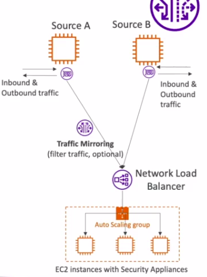

- You need to have the source and the targets to be in the same VPC or it could be across different VPC and if we have enabled VPC Peering in case of multiple sources

- _**Use cases**_:

    - content inspection

    - threat monitoring
    
    - troubleshooting

# VPC - IPv6

- IPv4 was designed to provide 4.3 billion addresses at the time of creation (they will all be exhausted) 

- So there needs to be a new scheme of IPs, and this is IPv6

- IPv6  is a successor of IPv4.

- IPv6 is designed to provide 3.4 x 10^38 unique IP addresses.

- Every IPv6 addresses are public and internet-routable. There's no private range in the IPv6 range.

- The format is X.X.X.X.X.X.X.X (where X is hexadecimal) where the range can be from 0000 to ffff.

- Eg :

    - :: - all 8 segments are 0
    
    - 2001:db8:: - last 6 segments are 0

    - 2001:db8:: 1234:5678 - middle 4 segments are 0

    - 2001:db8:3333:4444:5555:7777:eeee:ffff

## IPv6 in VPC 

- You can enable IPv6 supports in our VPC.

- IPv4 can never be disabled for your VPC and subnets,

- You can enable IPv6 (they're public IP addresses) to operate in dual stack mode.

    - That means your EC2 instances when launched in your VPC will get a private internal IPv4 and a public IPv6 
    
- They can communicate using either IPv4 or IPv6 to the internet through an internet gateway.

## IPv6 troubleshooting

- IPv4 cannot be disabled for your VPC and subnets.

- If you have an IPv6-enabled VPC and you cannot launch an EC2 instance in your subnets

    - then it's not because the instance can not acquire an IPv6 because the space is actually very large and there will be enough IPv6s for your EC2 instances.

    - it's because there are no available IPv4 left in your subnets.

- Solution : create an IPv4 CIDR in your subnet.

# Egress Only Internet Gateway (for IPv6)

- Used for IPv6 only

- Similar to NAT gateway (which is for IPv4) but for IPv6

    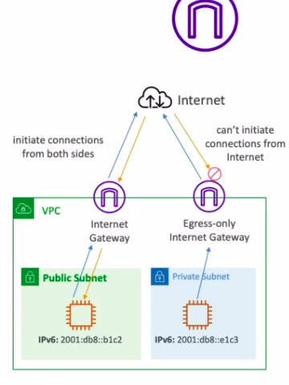

- Allows instances in your VPC outbound connections over IPv6 while preventing the internet to initiate an IPv6 connection to your instances

- You must update Route Tables

## IPv6 Routing 

- NAT gateway - for IPv4 addresses in private subnet

- Egress only IGW - for IPv6 addresses in private subnet

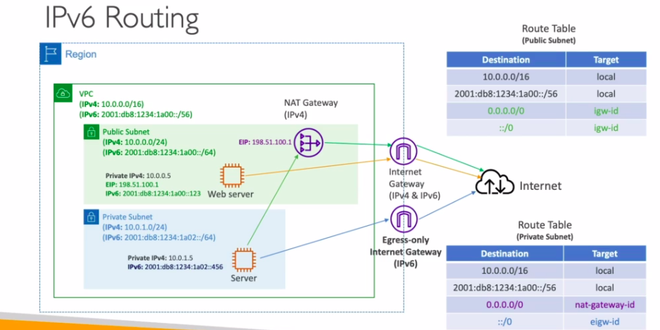

# SUMMARY 

- _**CIDR**_ : an IP range.

- _**VPC**_ : is a Virtual Private Cloud, which is working for IPv4 and IPv6.

- _**Subnets**_ : are tied to an AZ in which we define CIDRs and we have public and private subnets.

- _**Why do we have a public subnets?**_

    - we attach an internet gateway and then we cut a route from from the public subnet to the internet gateway
    
- _**Internet Gateway**_ : provides IPv4 and IPv6 internet access if enabled.

- _**Route tables**_ : must be edited to have routes to the alternate gateway, the VPC peering connections, the VPC endpoints, and so on. And they're key to make sure that the network flows within our VPC.

- _**Bastion Host**_ : a public EC2 instance that we were able to SSH into, and this instance had SSH connectivity to other EC2 instances in private subnets.

- _**NAT Instances**_ : an EC2 instance deployed in a private, in a public subnet to give internet access to EC2 instances in the private subnets. It is old. It is getting deprecated and you need to disable the source destination check flag for it to work and also edit your security group rules.

- _**NAT gateway**_ : is much better. It's managed by AWS. It provides scalable internet access to private EC2 instances, and it only works for IPv4.

- If you want to have the private DNS using Route 53, you need to enable DNS resolution and DNS hostname settings in your VPC.
Private DNS + Route 53 - enable DNS resolution + DNS Hostnames

- _**NACL**_ : network SCLs and they were firewall rules to define inbound and outbound access at the subnet level, are stateless -> so inbound and outbound rules are always evaluated. (Ephemeral Ports)

- _**Security group rules**_ : are stateful. That means that if the inbound is allowed, the outbound is automatically allowed and vice versa. And security group rules are applied at the EC2 instance level.

- _**VPC Reachability Analyzer**_ : allowing us to perform some network connectivity testing between different AWS resources and debug them.

- _**VPC Peering**_ : helpful to connect two VPCs together and only if they have none overlapping CIDRs, and VPC Peering connections are non-transitive so if you need to connect 3 VPCs together, you need to have 3 VPC Peering connections.

- _**VPC endpoints**_ : allowing us to get private access to AWS services such as Amazon S3, DynamoDB, CloudFormation, SSM within a VPC.

    - gateway end points for Amazon S3 and DynamoDB
    
    - all the rest was interface end points. 
    
- _**VPC Flow Logs**_ : way for us to get some level of metadata around all the packets within our VPC, and we had some information around the ACCEPT and REJECT traffic. Now, VPC Flow Logs can be created at the VPC subnets or ENI level, and they can be analyzed and sent to Amazon S3 and then analyzing Athena, or they can be sent
to CloudWatch logs and then analyzed using CloudWatch Logs Insights for example.

- If you connect your VPC to your data center, you have two options. 

    - **site-to-site VPN**
    
        - site-to-site VPN is a VPN connection over the public internet in which we have to create a virtual private gateway on AWS and a customer gateway on your sensor and then you establish a VPN connection.

        - if we establish multiple VPN connections using the same virtual private gateway, then we could use VPN CloudHub to have a hub-and-spoke VPN model to connect our sites.

    - **use Direct Connect**
    
        - connection is completely private. It does not go over the public internet,

        - it takes time to establish. You need to hook your own data center to a direct connect location for it to work.

        - it's more involved but it's more secure and has more stability onto the connection.

        - Direct Connect Gateway was to set up a direct connect to many VPCs in different AWS regions.

- _**PrivateLink or VPC Endpoint Services**_ : to connect privately to services within your VPC that you have created yourselves to customer VPC, it doesn't require VPC Peering, or the public internet, or NAT Gateway, or Route Tables. It's only used, mostly used with a Network Load Balancer and ENI, and this allows us to expose a service to hundreds or thousands of customer VPCs without exposing your network.

- _**ClassicLink**_ : to connect EC2-Classic instances privately to your VPC but it's going to be deprecated very soon too.

- _**Transit Gateway**_ : a transitive peering connection for your VPC, VPN and direct connect. Everything can flow through it.

- _**Traffic Mirroring**_ : to copy network traffic form your ENIs elsewhere for further analysis.

- _**IPv6 in VPC**_ : egress-only internet gateway, similar to a NAT Gateway but for IPv6 traffic out to the internet.

# NOTE 

1. CIDR not should overlap, and the max CIDR size in AWS is /16.

    - You have a corporate network of size 10.0.0.0/8 and a satellite office of size 192.168.0.0/16. The CIDR 172.16.0.0/16 is acceptable for your AWS VPC if you plan on connecting your networks later on

2. Security Groups operate at the EC2 instance level while NACLs operate at the subnet level.

3. NAT Gateway provides Internet access to your EC2 instances in private subnets with IPv4 while making sure this solution requires the least amount of administration and scales seamlessly.

4. Private EC2 instances can access internet via NAT gateway; public EC2 instances can access internet via Internet Gateway.

5. Route tables must be updated in both VPCs that are peered to enable communication.

    - VPC Peering has been enabled between VPC A and VPC B, and the route tables have been updated for VPC A. If the route tables for VPC B is not updated then the EC2 instances cannot communicate.

6. USE CASE OF Direct Connect Gateway :

    - You have set up a Direct Connect connection between your corporate data center and your VPC A in your AWS account. You need to access VPC B in another AWS region from your corporate datacenter as well. Then use Direct connect gateway.

7. Amazon S3 and DynamoDB are the two services that have a VPC Gateway Endpoint, all the other ones have an Interface endpoint (powered by Private Link - means a private IP).

8. VPC Flow Logs is a VPC feature that enables you to capture information about the IP traffic going to and from network interfaces in your VPC.

9. Hosted Direct Connect connection supports 50Mbps, 500Mbps, up to 10Gbps Direct Connect connection between your corporate datacenter to AWS.

10. VPC Endpoint Services allows you to expose a private application to other AWS customers without making the application public to the Internet and without making a VPC Peering connection.

11. When you set up an AWS Site-to-Site VPN connection between your corporate on-premises datacenter and VPCs in AWS Cloud, VPGW and Customer GW are the two major components you want to configure for this connection.

12. AWS VPN CloudHub allows you to securely communicate with multiple sites using AWS VPN. It operates on a simple hub-and-spoke model that you can use with or without a VPC.

13. AWS Direct Connect provides private, consistent connection and traffic does not travel through the Internet.

14. Using a Direct Connect connection, you can access both public and private AWS resources.

