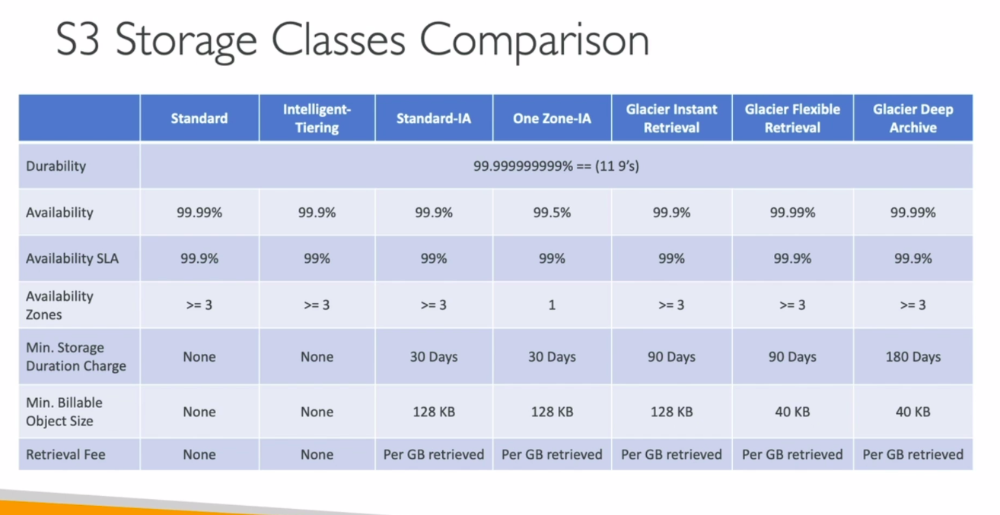
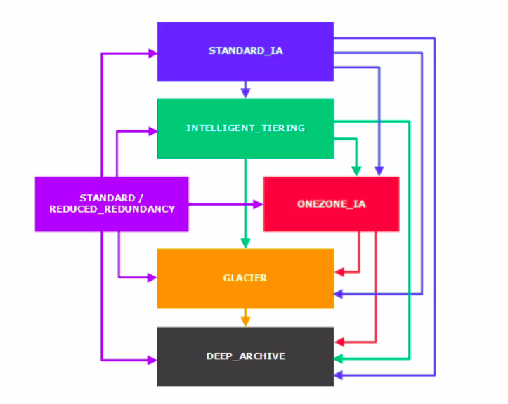

# S3 - infinitely scaling storage

# S3 Buckets

- S3 allows to store objects (files) in buckets (directories)

- buckets must have a globally unique name 

- though S3 is a global service, buckets are defined at regional level

- Naming convention of buckets :

    - No uppercase

    - No underscore

    - 3-63 characters long

    - shouldn't be an IP

    - must start with lowercase letter or number


## Objects

- objects have a key (it is a full path)  
    Eg :  s3://my-bucket/my_folder/another_folder/my_file.txt 
    - bucket -> my-bucket
    
    - key -> my_folder/another_folder/my_file.txt

- key = prefix + object name

    - prefix : my_folder/another_folder/

    - object name : my_file.txt

- there's no concept of directories within buckets, they're just keys with very long names that contain slashes

- object values = content of the body

    - max size : 5TB

    - can't upload more than 5GB at a time. in order to do so use `multi-part upload`

- metadata = list of text key - value pairs (system or user metadata)

- tags = unicode key - value pair up to 10 which are useful for security

- Version ID - when versioning is enabled

# S3 - versioning

- versioning enabled at bucket level

- helps to protect against unintended deletes

- easy roll back to previous versions

- any file that is not versioned prior to enabling versioning will have version - 'full'

- suspending versioning will not delete the previous versions

# S3 - encryption

4 methods 

- **_SSE-S3_** : (Server Side Encryption - S3)

    - encryption using keys handled & managed by Amazon S3

    - object is encrypted server side 

    - HTTP/ HTTPS to be used to upload the object into S3

    - AES-256 encryption (algorithm)

    - must set header - `"x-amz-server-side-encryption":"AES256"`

- **_SSE-KMS_** : (Server Side Encryption - Key Management service)

    - encryption using keys handled & managed by KMS

    - Advantage : user control, audit trail

    - object is encrypted server side

    - HTTP/ HTTPS to be used to upload the object into S3

    - must set header - `"x-amz-server-side-encryption":"aws:kms"`

- **_SSE-C_** : 

    - encryption using data keys fully managed by the customer outside of AWS

    - S3 doesn't store the encryption keys

    - HTTPS must be used to upload the object into S3

    - Encryption must be provided in HTTP header for every HTTP request made

- **_Client side encryption_** :

    - Client library such as Amazon S3 Encrytpion Client enables us to perform the Client side encryption

    - Clients must encrypt and decrypt data themselves before sending to and when receiving from S3

    - Customer fully manages the keys and encryption cycle

# Encryption in Transit

- Amazon S3 exposes:

    - HTTP endpoint: non encrypted

    - HTTPS endpoint: encryption in flight

- You're free to use the endpoint you want, but HTTPS is recommended

- Most clients would use HTTPS endpoint by default

- HTTPS is mandatory for SSE-C

- Encyption in flight is also called SSL/TLS

# S3 Security

- **_User based_** :

    - IAM policies - which API calls should be allowed for a specific user from IAM console

- **_Resource based_** :

    - Bucket policies - bucket wide rules from the S3 console - allows cross account

    - Object Access Control List (ACL) - finer grain

    - Bucket Access Control List (ACL) - less common

- an IAM principal can access an S3 object if

    - the user IAM permissions allow it or the resource policy ALLOWS it

    - and there's no explicit DENY

## S3 Bucket Policies

- JSON based policies

- can be used to Grant Public Access to the bucket

- Force objects to be encrypted at upload

- Grant Access to another account (Cross Account)

## Bucket Settings for Block Public Access

- Blocks public access to buckets and objects granted through : 
    
    - new access control list (ACLs)

    - any access control list (ACLs)

    - new public bucket or access point policies

- These settings were created to prevent company data leaks

- Can be enabled at account level

## Others 

- **_Networking_** :

    - Supports VPC Endpoints (for instances in VPC without www internet)

- **_Logging and Audit_** : 

    - S3 Access Logs can be stored in another S3 bucket

    - API calls can be logged in CloudTrail

- **_User Security_**

    - **MFA Delete**: MFA can be a requirement in versioned buckets to delete objects

    - **Pre-Signed URLs**: URLs that are valid only for a limited time

# S3 Websites

- S3 allows us to host static websites on the www

- The website URL will be:
    ```
    <bucket-name>.s3-website-.amazonaws.com OR
    <bucket-name>.s3-website..amazonaws.com
    ```

- If you get a 403 Forbidden Error, make sure bucket policy allows public reads

- To make objects public in a bucket, you need to : 

    - Disable block public access
    
    - Create a bucket policy that allows public access

# S3 CORS - Cross Origin Resource Sharing

- An origin is a scheme(protocol), host(domain) and port  
    Eg: https://example.com
    - protocol - https
    
    - domain - example.com

    - Port 443 for HTTPS

- CORS is a web browser based mechanism to allow request to other origins while visiting main origin

- Same origins: http://example.com/app1 & http://example.com/app2

- Different Origins: http://example.com/ & http://mynotes.com/

- The requests won't be fulfilled unless the other origin allows for the requests using CORS Headers (eg: Access-Control-Allow-Origin)

- If a client needs to do a cross-origin request on our S3 bucket, you need to enable the correct CORS headers

- You can allow for a specific origin or for all origins (*)

# Amazon S3 - Consistency Model

- As of December 2020, S3 has been strongly consistent

- Consistent -> a read request after an updation or creation of the object will immediately reflect changes

    - read after write consistency

    - list consistency

- Available at no additional cost, without any performance impact

# S3 - MFA Delete

- MFA forces user to generate a code on their device before doing important operations on S3

- MFA-Delete can be used only if bucket versioning is enabled

- You will need MFA to:

    - Suspend versioning on the bucket

    - Permanantly delete an object version

- You don't need MFA for:

    - Enabling versioning

    - Listing deleted versions

- Only the root account (bucket owner) can enable/disable MFA-Delete

- MFA-Delete currently can be enabled only using the CLI

# S3 - Default Encryption vs Bucket Policies

- Encryption can be done in 2 ways 

    - enable default encryption in the bucket setting

    - use bucket policy and refuse any API call to PUT an S3 object without encryption headers

- The bucket policies are first evaluated before default encryption

# S3 Access Logs

- For audit purposes, you may want to log all access to your S3 buckets

- Any request made to your S3 bucket, from any account, authorized or denied is logged into another S3 buckets of yours

- This data can be analyzed using data analysis tools or Amazon Athena

- _**NOTE**_ : Never set your logging bucket to be your monitored bucket, because it will create an infinite logging loop and your bucket will grow in size exponentially

# S3 Replication

- CRR: Cross Region Replication

- SRR: Same Region Replication

- Must enable versioning in both source and destination accounts

- Replication is asynchronous

- Buckets can be in different accounts

- Must give proper IAM permissions to S3

- CRR is used for lower latency access, compliance, replication across accounts

- SRR is used for log aggregation, live replication between prod and test accounts

- After enabling replication, only the new objects are replicated

- To replicate existing objects, _**S3 Batch Replication**_ can be used

    - Replicates existing objects 
    
    - Replicates objects that failed replication
    
- Replicated objects have the same version ID

- For DELETE operations:

    - Can replicate delete markers (optional setting)

    - Deletions with version ID are not replicated. That is, deletions are not replicated, only delete markers can be replicated (to avoid malicious deletes)

- There is no chaining of replication

    - If bucket1 has replication into bucket2, which has replication into bucket3, the objects created in bucket1 are not replicated in bucket3

# S3 pre-signed URLs

- can be generated using SDK or CLI

    - For downloads (easy - use CLI)

    - For uploads (harder - use SDK)

- These URLs are valid for a default of 3600s. 

    - Can change the duration using --expires-in [TIME_BY_SECONDS] argument

- Users given the pre-signed URL inherit the permission of the user who generated the URL for GET / PUT

- **_Use cases_**:
    
    - Only allow logged in users to download a premium video on your S3 bucket

    - Allow an ever changing list of users to download files by generating URLs dynamically

    - Allow temporarily a user to upload a file to a precise location in our bucket
# S3 Storage Classes

- Various storage classes:

    - Amazon S3 Standard
    
    - S3 Infrequent Access (IA)

        - Standard IA
    
        - One-Zone IA
    
    - Glacier Storage classes :
    
        - Glacier Instant Retrieval
        
        - Glacier Flexible Retieval
        
        - Glacier Deep Archive
        
        - Intelligent Tiering

- Can move between these storage classes manually or using S3 Lifecycle Configurations

## S3 Durability and Availability

### Durability

- If you store 10M objects with Amazon S3, you can on average expect a loss of one object every 10,000 years

- S3 has high durability (99.999999999%, 11 9's) of objects across multiple AZ

- It is the same for all storage classes

### Availability

- Measure how readily a service is available

- Varies depending on storage classes

### S3 Standard - General Purpose

- For frequently accessed data

- Low latency & High Throughput

- Sustain 2 concurrent facility failures

- _**Use cases**_: 

    - Big data analytics
    
    - mobile and gaming applications
    
    - content distribution

## S3 Infrequent Access (IA)

- For less frequently accessed data but instant retrieval

- Lower cost than S3 standard

- Cost on retrieval

### One Zone IA

- high durability in a single AZ

- data is lost when AZ is destroyed

- _**Use cases**_: 

    - Storing secondary backup copies of on-premises data, or data you can recreate

### Standard IA 

- _**Use cases**_ :

    - Disaster Recovery
    
    - Backups

## Amazon S3 Glacier

- archive / backup data

- low-cost object storage

- Pricing: price for storage + object retrieval cost

### Amazon S3 Glacier Instant Retrieval

- Millisecond retrieval, great for data accessed once a quarter

- Minimum storage duration of 90 days

### Amazon S3 Glacier Flexible Retrieval

- Expedited (1-5 minutes); Standard (3-5 hrs); Bulk (5 - 12 hrs) - free

- Minimum storage duration of 90 days

### Amazon S3 Glacier Deep Archive 

- for long term storage

- Standard (12 hrs); Bulk (48 hrs)

- Minimum storage duration of 180 days

## S3 Intelligent Tiering

- Small monthly monitoring and auto-tiering fee

- Moves objects automatically between tiers based on usage

- There are no retrieval charges in S3 Intelligent Tiering Tiers:

    - Frequent Access Tier (automatic): default tier

    - Infrequent Access Tier (automatic): objects not accessed for 30 days

    - Archive Instant Access Tier (automatic): objects not accessed for 90 days

    - Archive Access Tier (optional): configurable from 90 days to 700+ days

    - Deep Archive Access Tier (optional): configurable from 180 days to 700+ days

- Minimum Storage Duration implies that the object is billed for a minimum of that duration, even if you delete it before that

    

# S3 Lifecycle 

## Moving between storage classes

- You can transition objects between storage classes

- For infrequently accessed object, move them to 'STANDARD_IA'

- For archive objects not required in real-time, 'GLACIER or DEEP_ARCHIVE'

- Moving Objects can be automated using **_Lifecycle Configuration_**

- You can't move objects to storage classes in the top. Transition can happen only from top to bottom

    

## S3 Lifecycle rules 

- _**Transition Action**_: Defines when to transition objects between storage classes. 

    For example,  
    - Move objects to Standard IA after 60 days after creation

    - Move to Glacier for archiving after 6 months

- _**Expiration Action**_ : Action that is used to expire (delete) objects after certain duration. For example,

    - Can be used to delete log files after 365 days

    - Can be used to delete old version of objects (if versioning is enabled)

    - Can be used to delete incomplete multi-part uploads
    
    - Rules can be created for specific prefixes you want (eg: s3://mybucket/mp3/*)

    - Rules can be created for specific object tags (eg: Department: Accounts)

# S3 Analytics - Storage Class Analysis

- You can enable S3 Analytics to help determine when to transition objects from Standard to Standard_IA

- Does not work for OneZoneIA or Glacier. Only for Standard to Standard_IA

- Report is updated daily

- Takes about 24h to 48h for first start

- Can be used first before defining lifecycle rules to get a better idea for when to transition between storage classes

# S3 Performance

## S3 Baseline Performance

- Amazon S3 automatically scales to high request rates, latency 100-200 ms

- Your application can achieve atleast 3,500 PUT/COPY/POST/DELETE requests and 5,500 GET/HEAD requests per second per prefix in a bucket

- There are no limits to prefixes in a bucket

- Eg: (object path => prefix)

    - mybucket/img/png/1 => /img/png/
    
    - mybucket/img/jpg/2 => /img/jpg/

- If you spread reads across these 2 prefixes evenly, you can achieve 10,000 requests per second for GET and HEAD

## S3 - KMS Limitation

- If you use SSE-KMS, you may be limited with the performance of KMS

- _**KMS quota per second**_: 5500, 10000, 30000 req/s based on region

- You can request a quota increase using the Service Quota Console

- When you upload an object (SSE-KMS), _**GenerateDataKey**_ KMS API is called, and Decrypt KMS API when you try to download an object

## S3 Upload Performance

### Multi-Part Upload

- recommended for files > 100 MB

- must for files > 5GB

- _**Use cases**_ :

    - Can help parallelix uploads 
    
    - speed up transfers

### S3 Transfer Acceleration

- Transfers file to nearest edge location to leverage AWS's private network for faster transfer speeds

- Compatible with multi-part upload

- _**Use cases**_ :

    - upload and download

## S3 Download Performance

### S3 Byte-Range Fetches

- Parallelize GETs by requesting specific byte ranges (Sped up Downloads)

- Better resilience in case of failures

- can also be used only to retrieve partial data. 
For eg, the head of a file which may contain some metadata about the file

# S3 Select and Glacier Select

- Retrieve less data using SQL by performing server side filtering

- Can filter by rows and columns

- Less network transfer, less CPU cost client side

# S3 Event Notifications

- You can react to Events happening in S3. 

- You can send these events to SQS, SNS or Lambda Functions to send notifications or perform any action

- Example of S3 Events:

    - S3:ObjectCreated
    
    - S3:ObjectRestore
    
    - S3:ObjectRemoved
    
    - S3:Replication 

- Object name filtering possible (Eg: *.jpg)

- _**Use Case*_: 

    - When an image is uploaded to S3, thumbnails should be created

- Can create as many S3 events as desired 

- S3 event notifications typically deliver events in seconds but sometimes can take a minute or longer


## S3 Event Notifications with Amazon EventBridge

- On integrating S3 Event Notifications with Amazon EventBridge, all the events are sent to Amazon EventBridge

- Advanced Filtering options with JSON rules (metadata, object size, name)

- _**Multiple Destinations**_ - You can send events to 18 AWS Services as destinations like Step Functions, Kinesis Stream/Firehose

- _**EventBridge Capabilities**_ - Archive, Replay Events, Reliable delivery

# S3 Requester Pays

- With Requester pays buckets, the requester (instead of the bucket owner) pays for the data transfer OUT of the bucket

- The requester must be authenticated with AWS (not anonymous)

- _**Use case**_ :

    - when you want to share large datasets with other AWS accounts

# Amazon Athena

- Serverless query services that uses SQL to perform analytics against S3 Objects

- Supports CSV, JSON, ORC, Avro and Parquet

- built on Presto engine

- Pricing: $5.00 per TB scanned

- Use compressed/columnar-data for cost-savings (less scan)

- _**Use cases**_: 

    - BI / analytics
    
    - analyze & query VPC flow logs, ELB Logs, CLoudTrail trails

# Glacier Vault Lock

- Adopts a WORM (Write Once Read Many) model

- Objects under lock cannot be deleted

- Lock the policy for future edits (can no longer be changed)

- Helpful for **compliance** and **data retention**

# S3 Object Lock

- Adopts a WORM model

- Locks the deletion of an object version for a specified amount of time (versioning must be enabled)

- _**Object Retention**_:

    - **Retention Period**: specifies a fixed time period

    - **Legal Hold**: same protection, no expiry date

- _**Modes**_:

    - **Governance Mode**: users can't overwrite or delete an object version or alter its lock setting unless you have special permissions

    - **Compliance Mode**: You cannot overwrite or delete an object version, no matter what (even if you're the root account). It's retention period also cannot be modified

